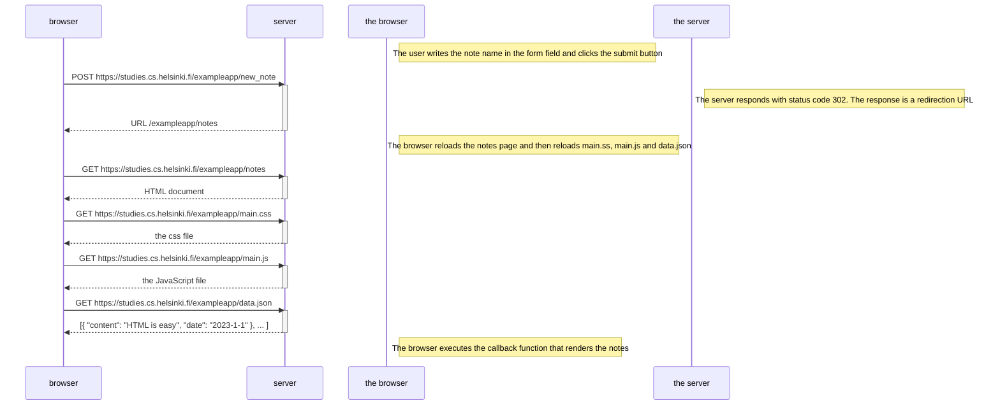

```mermaid
sequenceDiagram
    participant browser
    participant server

    Note right of the browser: The user writes the note name in the form field and clicks the submit button

    browser->>server: POST https://studies.cs.helsinki.fi/exampleapp/new_note
    activate server
    Note right of the server: The server responds with status code 302. The response is a redirection URL 
    server-->>browser: URL /exampleapp/notes
    deactivate server

    Note right of the browser: The browser reloads the notes page and then reloads main.ss, main.js and data.json

    browser->>server: GET https://studies.cs.helsinki.fi/exampleapp/notes
    activate server
    server-->>browser: HTML document
    deactivate server

    browser->>server: GET https://studies.cs.helsinki.fi/exampleapp/main.css
    activate server
    server-->>browser: the css file
    deactivate server

    browser->>server: GET https://studies.cs.helsinki.fi/exampleapp/main.js
    activate server
    server-->>browser: the JavaScript file
    deactivate server


    browser->>server: GET https://studies.cs.helsinki.fi/exampleapp/data.json
    activate server
    server-->>browser: [{ "content": "HTML is easy", "date": "2023-1-1" }, ... ]
    deactivate server

    Note right of the browser: The browser executes the callback function that renders the notes
```
