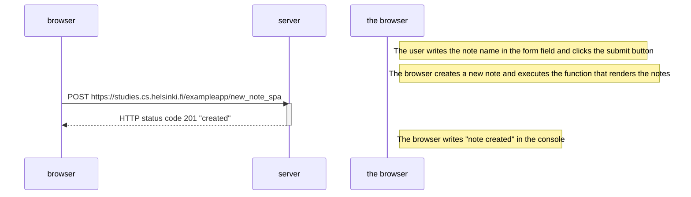

# Exercise 0.6

```mermaid
sequenceDiagram
    participant browser
    participant server

    Note right of the browser: The user writes the note name in the form field and clicks the submit button

    Note right of the browser: The browser creates a new note and executes the function that renders the notes 

    browser->>server: POST https://studies.cs.helsinki.fi/exampleapp/new_note_spa
    activate server
    server-->>browser: HTTP status code 201 "created"
    deactivate server

    Note right of the browser: The browser writes "note created" in the console 


```
